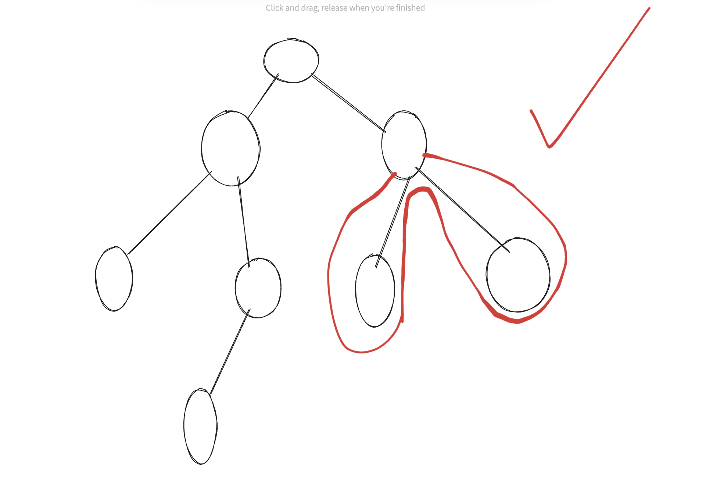
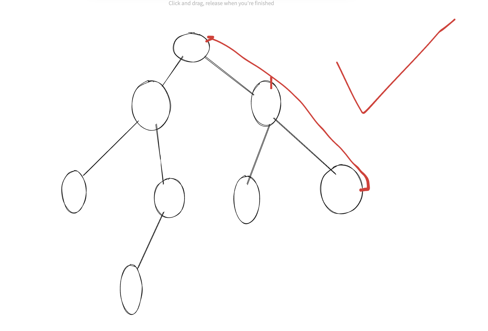

```
// here i stuck at the point where i thought the path can be curve+linear but no it is not either it is curve or it is linear both will not work see the images
int dfs(TreeNode* root, int &maxi){
  if(root==NULL) return 0;
  int l = dfs(root->left,maxi);
  int r = dfs(root->right,maxi);
  if(l<0) l = 0;
  if(r<0)  r = 0;
  maxi = max({maxi,l+r+root->val});
  return max(l,r)+root->val;
}
int maxPathSum(TreeNode* root) {
  if(root==NULL) return 0;
  int maxi = INT_MIN;
  dfs(root,maxi);
  return maxi;
}
```




